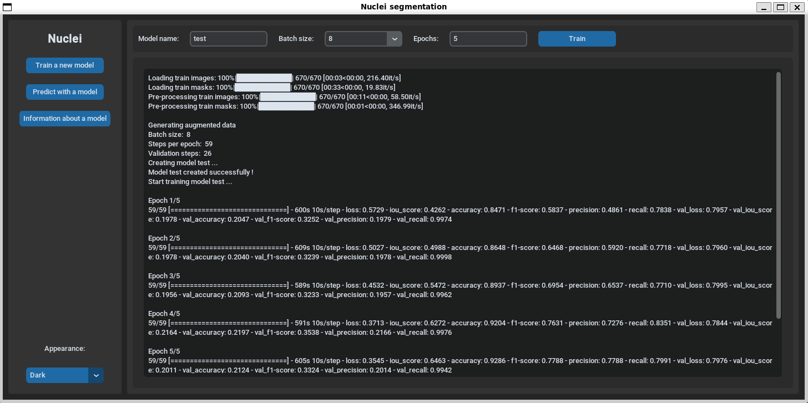
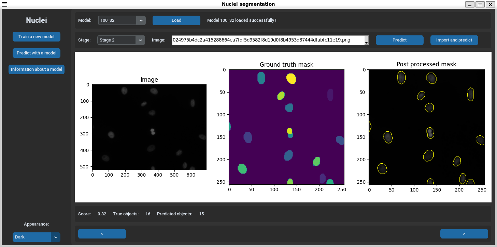
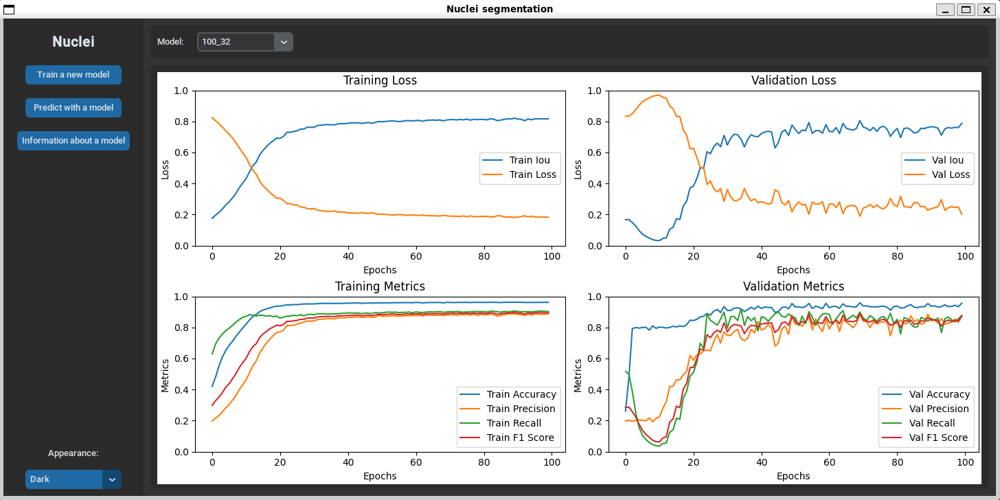

# nuclei-segmentation

Development of machine learning model for instance segmentation of nuclei cells for [Kaggle Data Science Bowl 2018 challenge](https://www.kaggle.com/c/data-science-bowl-2018). 

## Installation

First, clone the GitHub repository:

```bash
git clone https://github.com/yelmokht/nuclei-segmentation.git
```

Make sure that poetry is installed:

```bash
pip install poetry
```

Then, install all necessary packages:

```bash
poetry install
```

Note: If you are on Windows and use an Intel processor with an iGPU, you may encounter this error: ModuleNotFoundError: No module named 'tensorflow'.
To resolve this, do these commands on the terminal in order to install tensorflow-intel 2.15.0 in your virtual environment:

```bash
poetry shell
pip install tensorflow-intel==2.15.0
```

## Usage

Once installation is complete, you can run the application:

```bash
poetry run python src/main.py
```

## Data

This application uses the dataset from Kaggle Data Science Bowl 2018 available [here](https://drive.google.com/file/d/16gp8kPxMFrSDiLjgw2eaZmtrDccOjKKR/view?usp=sharing). If you use the application, the dataset will automatically be downloaded in the `data` folder.

```markdown
data
    ├── dsb-2018
    ├── unzipped
    └── data-science-bowl-2018.zip
```

## Models

This application utilizes deep learning and convolutionnal neural networks (CNN) with tensorflow/keras library. A pretrained model for this challenge is accessible [here](https://drive.google.com/drive/folders/1u1wopGBqXz7Qn5MnICORHx81nz30mZhL?usp=sharing). If you use the application, the model will automatically be downloaded in the `models` folder. You can also train a model inside the application using `Train a new model` feature but a GPU is recommended to function properly. Another option is to use Google Colab to train a model: you can use `nuclei.ipynb` available in the `notebook` folder. After training, the model and its history should normally be saved in your Google Drive. You can then insert them into the `models` folder following this structure:

```markdown
models
    ├── model_name
    │   ├── model.h5
    │   └── history.csv
```

## Screenshots of application




